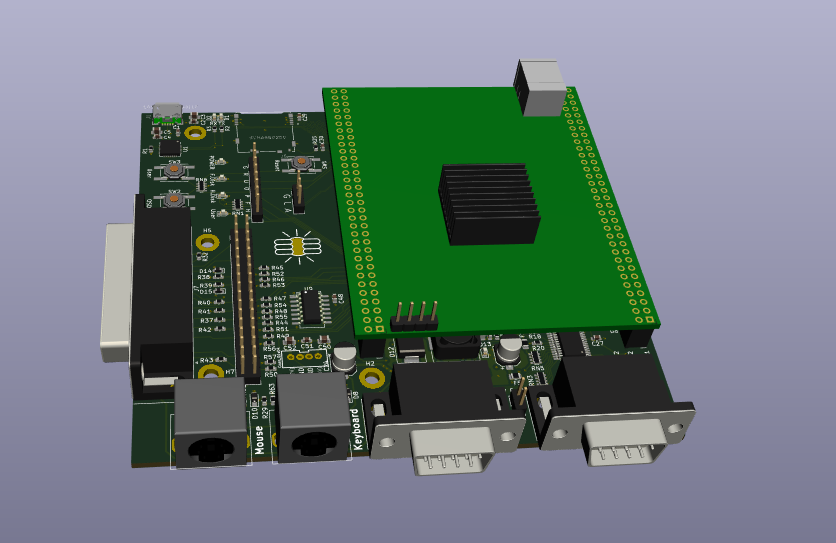

# Open Adaptive Amiga Retro System (Open AARS)

This PCB has been designed for my project in order to run the Minimig Amiga core on a board of my own design.
The core FPGA board I bought of Aliexpress, because soldering the very fine pitched BGA socket is too cumbersome.

More detailed documents regarding the I/O board can be found in the docs directory in this repository.

A Minimig AGA port for this board: [MinimigAGA_TC64](https://github.com/ranzbak/MinimigAGA_TC64/tree/phdev)
The ported version for Open AARS board can be found in the *'phdev'* branch.

## Interfaces provided by this I/O board

- Atari/Amiga compatible Joystick ports
- PS/2 keyboard interface for mouse and keyboard
- Analog audio out, head phone jack using MAX9850 IC
- External floppy interface to connect Amiga floppy drives (Including 12V power pin)
- HDMI display connector video (up to 720p 60Hz)
- 4 status LEDS
- Internal Amiga floppy drive connector
- External Amiga floppy drive connector (DIN-23)
- AS4C16M16SA-6TCN 32Mb SDRAM
- SD-card interface
- RS-232 over USB to program and communicate with the Amiga or Debug
- I2C bus connecting to MAX9850(Audio) and ADV7511 (HDMI transmitter)

## Platforms that _could_ run with this IO board

- Amiga 1200/500(+) - Functional
- Atari ST
- C64
- Other 80's and 90's machines?

Keep in mind I'm only planning on making an Amiga core for this board, but feel free to contribute other cores.

# The two boards that are compatible with this design are

## QM_XC7A100T_DDR3

### Specs

- On-Board FPGA: XC7A100T-2FGG676I;
- On-Board FPGA external crystal frequency: 50MHz;
- XC7A100T-2FGG676I has rich block RAM resource up to 4,860Kb;
- XC7A100T-2FGG676I has 101,440 logic cells;
- On-Board MT25QL128 SPI Flash,16M bytes for user configuration code;
- On-Board 256MB Micron DDR3，MT41K128M16JT-125:K;
- On-Board 3.3V power supply for FPGA by using MP2315 wide input range DC/DC;
- XC7A100T core board has two 64p, 2.54mm pitch headers for extending user IOs. All IOs are precisely designed with length matching;
- XC7A100T core board has 3 user switches;
- XC7A100T core board has 4 user LEDs;
- XC7A100T core board has JTAG interface, by using 6p, 2.54mm pitch header;
- XC7A100T core board PCB size is: 6.7cm x 8.4cm;
- Default power source for board is: 1A@5V DC, the DC header type: DC-050, 5.5mmx2.1mm;

### Github repo

[QM_XC7A100T_STARTER_KIT](https://github.com/ChinaQMTECH/QM_XC7A100T_STARTER_KIT)

### Listings at this time (2019-12-29)

- [Ebay QMTECH Xilinx FPGA Artix7 Artix-7 XC7A100T Core Board](https://www.ebay.com/itm/QMTECH-Xilinx-FPGA-Artix7-Artix-7-XC7A100T-Core-Board-/173922141347)
- [Aliexpress QMTECH Xilinx FPGA Artix7 Artix-7 XC7A100T DDR3 Core Board](vid=bcf629d3-8718-47b9-bad6-a31d7b1e778c&algo_expid=bcf629d3-8718-47b9-bad6-a31d7b1e778c-14&btsid=29203478-817f-4791-b6b6-1687369426ed&ws_ab_test=searchweb0_0,searchweb201602_3,searchweb201603_53)

## QM_XC7A35T_DDR3

For this FPGA, the Minimig core is WIP.

### Specs

- On-Board FPGA: XC7A35T-1FTG256C;
- On-Board FPGA external crystal frequency: 50MHz;
- XC7A35T-1FTG256C has rich block RAM resource up to 1,800Kb;
- XC7A35T-1FTG256C has 33,280 logic cells;
- On-Board MT28QL128 SPI Flash, 16M bytes for user configuration code;
- On-Board 256MB Micron DDR3, MT41J128M16JT-125:K;
- On-Board 3.3V power supply for FPGA by using MP2315 wide input range DC/DC;
- XC7A35T development board has two 64p, 2.54mm pitch headers for extending user IOs. All IOs are precisely designed with length matching;
- XC7A35T development board has 2 user switches;
- XC7A35T development board has 3 user LEDs;
- XC7A35T development board has JTAG interface, by using 6p, 2.54mm pitch header;
- XC7A35T development board PCB size is: 6.7cm x 8.4cm;
- Default power source for board is: 1A@5V DC, the DC header type: DC-050, 5.5mmx2.1mm;

### Github repo

[QM_XC7A35T_DDR3](https://github.com/ChinaQMTECH/QM_XC7A35T_DDR3)

### Listings at this time (2019-12-29)

- [Ebay Xilinx FPGA Artix7 Artix-7 Core Board XC7A35T DDR3 256MB](https://www.ebay.com/itm/Xilinx-FPGA-Artix7-Artix-7-Core-Board-XC7A35T-DDR3-256MB/293211934785?hash=item4444cb1041:g:YGgAAOSw5SNdbdkY)
- [Aliexpress QMTECH Xilinx FPGA Artix7 Artix-7 Core Board XC7A35T DDR3 256MB](https://www.aliexpress.com/item/1000006630084.html?spm=a2g0o.productlist.0.0.41cd3b52ViiSyG&algo_pvid=42b95d99-f036-43b5-8cb0-6ca9003178e8&algo_expid=42b95d99-f036-43b5-8cb0-6ca9003178e8-3&btsid=62811540-f61c-4c9d-b4b2-447e53cca01b&ws_ab_test=searchweb0_0,searchweb201602_3,searchweb201603_53)

** Make sure to ask the seller to ship the board without the female headers soldered on, for the Open AARS board male headers are needed. **

## Disclaimer

THE PROJECT IS PROVIDED "AS IS", WITHOUT WARRANTY OF ANY KIND, EXPRESS OR IMPLIED, INCLUDING BUT NOT LIMITED TO THE WARRANTIES OF MERCHANTABILITY, FITNESS FOR A PARTICULAR PURPOSE AND NONINFRINGEMENT. IN NO EVENT SHALL THE AUTHORS OR COPYRIGHT HOLDERS BE LIABLE FOR ANY CLAIM, DAMAGES OR OTHER LIABILITY, WHETHER IN AN ACTION OF CONTRACT, TORT OR OTHERWISE, ARISING FROM, OUT OF OR IN CONNECTION WITH THE PROJECT OR THE USE OR OTHER DEALINGS IN THE PROJECT.
